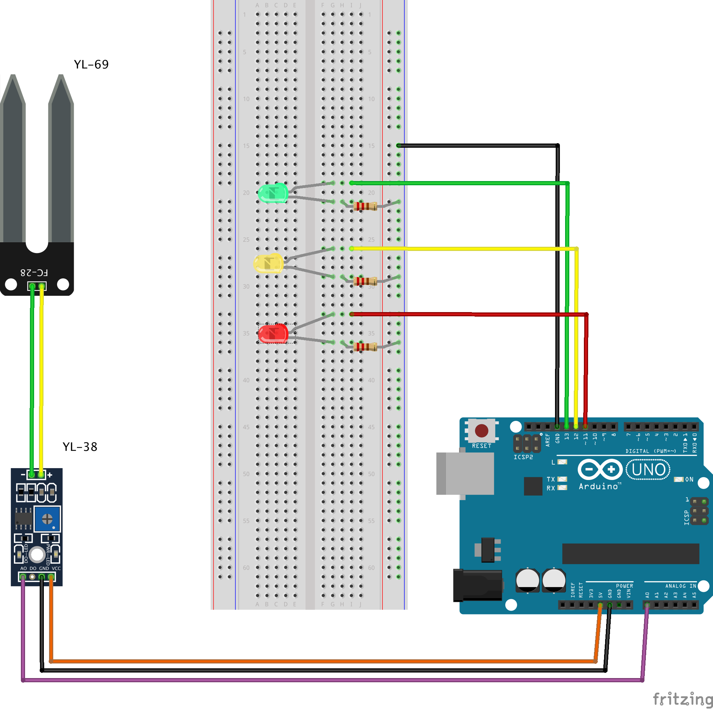

# TimeToWaterYourPlant
Arduino project that tells you when its time to water your plant. Technically, its soil. Not plant. :D

### There are 3 indicator LEDs for 3 different states:
1. RED: Means there is an error or soil sensor is out of the soil.
2. YELLOW: Means the soil is dry and this is when you should water your plant.
3. GREEN: Tells you that your soil is humid and there's no need to water.

# Fritzing diagram:

Have fun!
